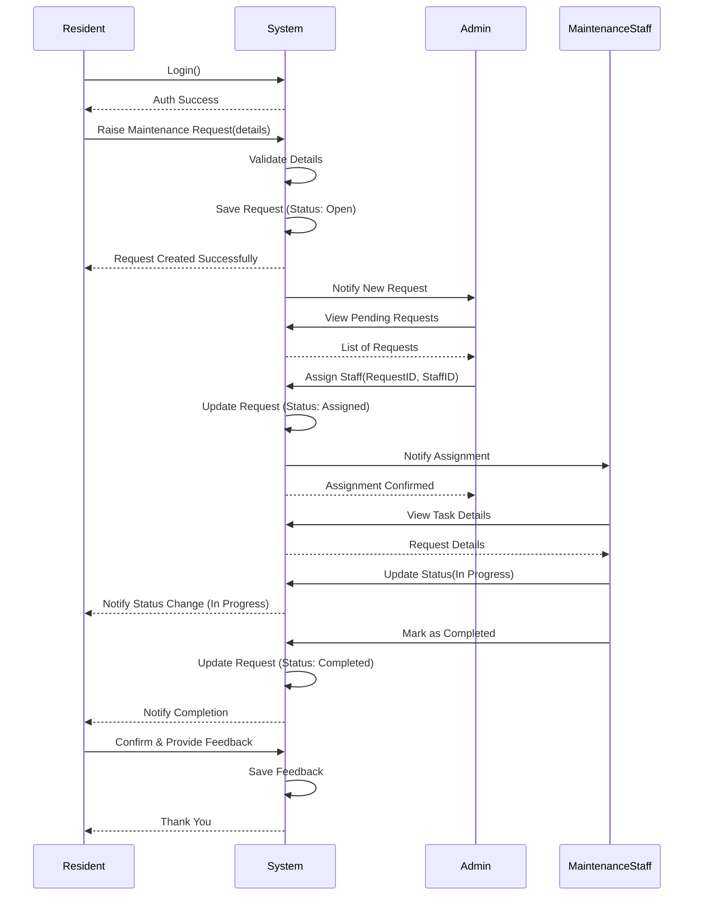

# Sequence Diagram

## Maintenance Request Lifecycle

```mermaid
sequenceDiagram
    participant Resident
    participant System
    participant Admin
    participant MaintenanceStaff

    Resident->>System: Login()
    System-->>Resident: Auth Success

    Resident->>System: Raise Maintenance Request(details)
    System->>System: Validate Details
    System->>System: Save Request (Status: Open)
    System-->>Resident: Request Created Successfully

    System->>Admin: Notify New Request
    
    Admin->>System: View Pending Requests
    System-->>Admin: List of Requests
    
    Admin->>System: Assign Staff(RequestID, StaffID)
    System->>System: Update Request (Status: Assigned)
    System->>MaintenanceStaff: Notify Assignment
    System-->>Admin: Assignment Confirmed

    MaintenanceStaff->>System: View Task Details
    System-->>MaintenanceStaff: Request Details

    MaintenanceStaff->>System: Update Status(In Progress)
    System-->>Resident: Notify Status Change (In Progress)

    MaintenanceStaff->>System: Mark as Completed
    System->>System: Update Request (Status: Completed)
    System-->>Resident: Notify Completion

    Resident->>System: Confirm & Provide Feedback
    System->>System: Save Feedback
    System-->>Resident: Thank You
```
